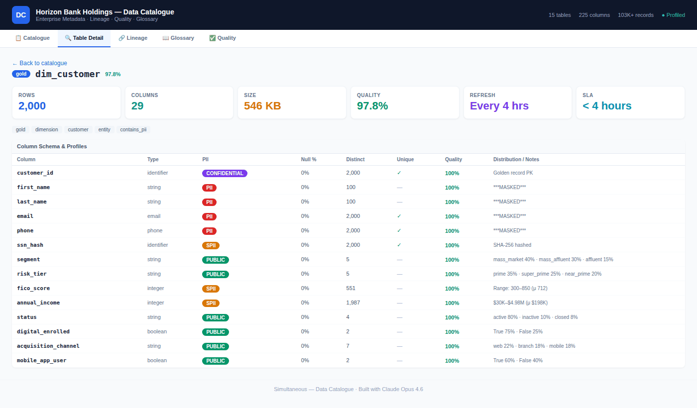
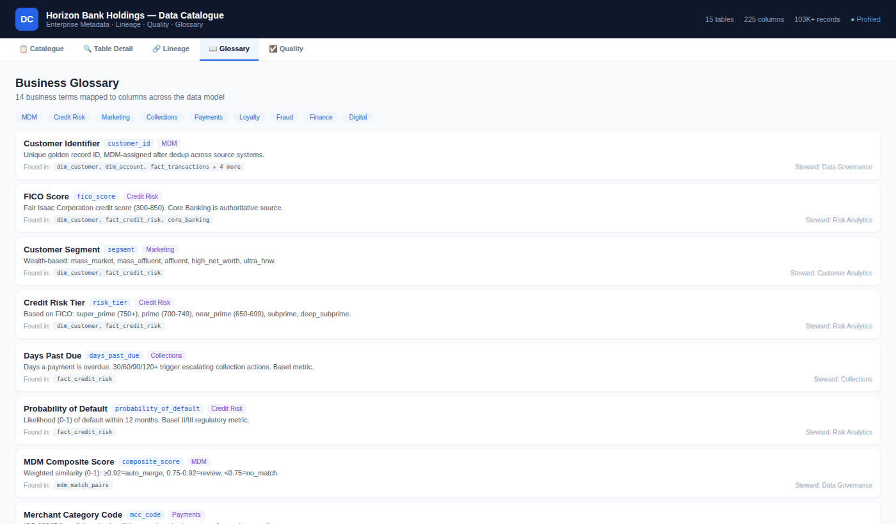

# 📚 Horizon Bank Holdings — Enterprise Data Catalogue

> **Auto-profiling metadata platform for the MDM Lakehouse**
> Built with Claude Opus 4.6 AI Agents • Python • React

---

## 🎯 What Is This?

A **self-building data catalogue** that auto-profiles every table in the Horizon Bank Holdings MDM Lakehouse — generating rich metadata, PII classifications, data lineage, business glossary terms, and quality scores. No manual documentation. No tribal knowledge. The catalogue builds itself from the data.

### Catalogue Browser


### Table Detail — Column-Level Profiling


### Data Lineage Map


### Business Glossary


### Data Quality Observatory


---

## 📊 Key Stats

| Metric | Value |
|--------|-------|
| Tables profiled | 15 |
| Columns profiled | 225 |
| Total records | 103,443 |
| Avg quality score | 98.6% |
| Business glossary terms | 17 |
| PII columns detected | 23 |
| Lineage nodes mapped | 15 tables + 3 sources |
| Quality dimensions | 6 (completeness, accuracy, consistency, timeliness, uniqueness, validity) |

---

## 🏗️ Architecture

```
┌──────────────────┐     ┌────────────────────┐     ┌──────────────┐     ┌──────────────┐
│    DATA LAYER    │────▶│  CATALOGUE ENGINE   │────▶│  METADATA    │────▶│ CATALOGUE UI │
│                  │     │                     │     │  STORE       │     │              │
│ 15 CSV tables    │     │ Python auto-profiler│     │ JSON profiles│     │ React 5-tab  │
│ 103K+ records    │     │ Column stats + PII  │     │ Quality rpts │     │ Interactive  │
│ Bronze→Gold      │     │ Lineage + Glossary  │     │ Lineage maps │     │ Searchable   │
└──────────────────┘     └────────────────────┘     └──────────────┘     └──────────────┘
```

---

## 📁 Repository Structure

```
data-catalogue/
├── README.md
├── src/
│   ├── catalogue_engine/
│   │   └── catalogue_engine.py      # Auto-profiling engine (Python)
│   └── ui/
│       └── DataCatalogue.jsx         # React catalogue UI (5 tabs)
│
├── data/
│   ├── bronze/                       # Source system replicas (3 CSVs)
│   ├── gold/                         # Star schema tables (7 CSVs)
│   ├── clickstream/                  # Digital events
│   ├── fraud/                        # Fraud alerts
│   ├── partners/                     # Partner performance
│   ├── realtime/                     # Hourly metrics
│   ├── mdm/                          # Match pairs
│   ├── catalogue_metadata/           # Generated metadata (JSON)
│   │   ├── master_catalogue.json     # All table profiles
│   │   ├── quality_report.json       # Aggregate quality report
│   │   ├── business_glossary.json    # Exported glossary
│   │   ├── lineage_map.json          # Lineage definitions
│   │   └── *_profile.json            # Per-table profiles (15 files)
│   ├── glossary/
│   ├── lineage/
│   └── quality_profiles/
│
├── docs/
│   ├── gifs/                         # Animated GIFs of all 5 tabs
│   │   ├── 01_Catalogue_Browser.gif
│   │   ├── 02_Table_Detail.gif
│   │   ├── 03_Lineage_Map.gif
│   │   ├── 04_Business_Glossary.gif
│   │   └── 05_Quality_Observatory.gif
│   └── Data_Catalogue_Deck.pptx      # 6-slide presentation
│
└── tests/
    └── test_catalogue.py             # Catalogue validation tests
```

---

## 🚀 Quick Start

```bash
# 1. Run the catalogue engine (profiles all 15 tables)
python src/catalogue_engine/catalogue_engine.py --data-dir ./data

# 2. View generated metadata
cat data/catalogue_metadata/quality_report.json

# 3. Open the React UI
# Load src/ui/DataCatalogue.jsx in Claude.ai Artifacts
```

---

## 🔍 5 Catalogue Views

| # | View | What It Shows |
|---|------|---------------|
| 1 | **Catalogue Browser** | Searchable/filterable table of all 15 tables with layer, rows, quality, PII tags, owner |
| 2 | **Table Detail** | Column-level schema, data types, PII classification, null rates, cardinality, distributions |
| 3 | **Lineage Map** | Interactive SVG: Source Systems → Bronze → MDM → Gold → Downstream |
| 4 | **Business Glossary** | 17 searchable terms with definitions, domains, stewards, cross-table references |
| 5 | **Quality Observatory** | Heatmap, radar chart, PII distribution, 34/34 DQ tests, 98.6% avg score |

---

## 🔐 PII Classification

The catalogue engine automatically classifies every column:

| Classification | Count | Examples |
|---------------|-------|---------|
| **PII** | 23 | first_name, email, phone, address, DOB |
| **SPII** | 14 | ssn_hash, fico_score, annual_income, probability_of_default |
| **CONFIDENTIAL** | 28 | account_id, balance, credit_limit, risk_score |
| **PUBLIC** | 160 | state, zip, acquisition_channel, status, segment |

---

## 📈 Connects to the MDM Lakehouse

This data catalogue is designed to sit alongside the [Horizon Bank MDM Lakehouse](../finserv-mdm-lakehouse/) as the governance and discovery layer:

```
MDM Lakehouse (data platform)  ←→  Data Catalogue (governance)  ←→  10 Executive Dashboards (consumption)
```

Together they form a complete **"Idea to Display"** pipeline: from raw source systems to governed, documented, queryable, dashboard-ready analytics.

---

**Built with Claude Opus 4.6 | Anthropic | Simultaneous**
